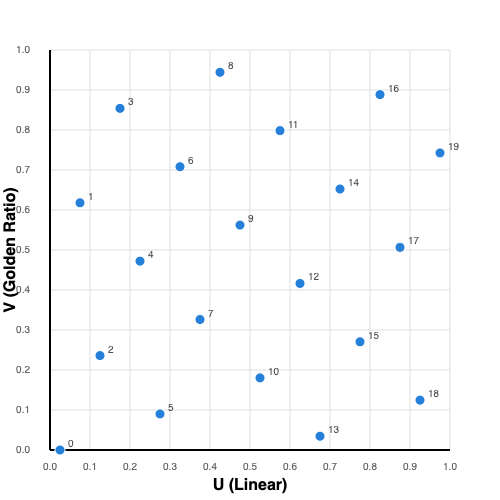
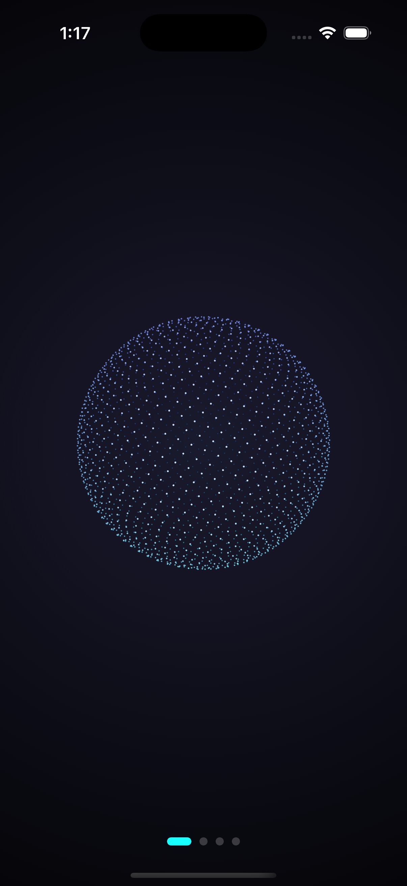
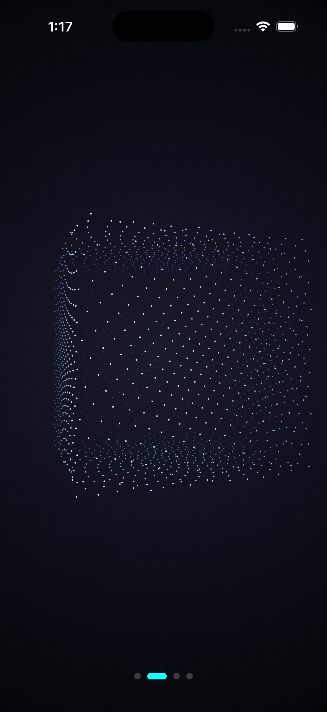
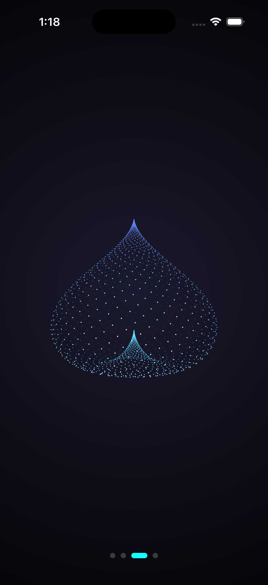
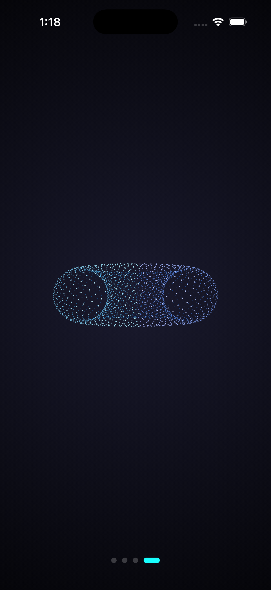

# Shape Morphing: From 2D Dots to 3D Magic ✨

Let's be honest: genuine 3D programming is intimidating. It usually demands game engines, shader languages, and a degree in linear algebra.
I didn't want any of that. **I just wanted to make some dots dance.**

This project is a visual experiment. It asks a simple question: Can we create a stunning, immersive 3D experience in Flutter using nothing but high-school math and a standard 2D canvas?

(Spoiler: Yes. And it's easier than you think.)

Here is the step-by-step ladder of how we trick the machine—and your eyes.

---

## 🪜 Step 1: The Foundation (Order from Chaos)

Everything begins with a cloud of points. But not just any cloud.

If you ask a computer for "random" points, it gives you noise. It gives you clumps, awkward gaps, and ugliness.
We don't want noise. We want **texture**. We want points that look scattered by a cosmic wind yet are placed with surgical precision.

### The Golden Secret
To achieve this, I used **Nature’s Cheat Code: The Golden Ratio (φ ≈ 1.618...)**.
By incrementing every new point by the "Golden Angle", each dot naturally lands in the largest available gap. It is mathematically impossible for them to clump.

---

## 🪜 Step 2: The "Soul" (Seeds)

Before a point becomes a pixel on your screen, it is born as a **Seed**.
Think of a seed as the **permanent DNA** of a particle. It consists of just two numbers:
1.  **u**: Its position in the lineup (0.0 to 1.0).
2.  **v**: Its unique Golden Ratio ID.

When you plot these raw seeds, you see the perfect lattice structure hidden beneath the chaos:

These seeds are immortal. They never change. Whether the particle is part of a cube or a heart, its "soul" (these two numbers) remains exactly the same.

---

## 🪜 Step 3: The Costume Change (Sculpting Shapes)

Now that we have our souls, we need bodies. we "dress them up" by running their seed numbers through different 3D equations.

  
  
  
  

### 1. 🔮 The Sphere (The Spiral)

The Sphere is our "Base Truth". We map the seeds in two elegant moves:
*   **The Stack:** First, we map `u` to the **Y-axis**. This stacks the points in horizontal slices from bottom to top.
*   **The Twist:** Then, we use `v` to spin the point around the **X-Z plane**.
Because of the Golden Ratio, every point rotates *just enough* to dodge the one below it. The result is a perfect, non-repeating spiral that wraps the entire globe.

### 2. 🧊 The Cube (The Laser Trick)

We don't build a cube; we carve it.
Imagine standing at the exact center of the sphere and firing a laser beam through every single point. We trace that beam until it smack into the walls of a box.
Mathematically, we take the sphere point and divide it by its largest coordinate (`max(x, y, z)`). This **"normalizes"** the sphere, snapping every curved point outward until it hits the flat surface of a cube. It’s a brutish, simple hack that preserves the beautiful distribution of the sphere.

### 3. ❤️ The Heart (The Harmonic)

This is where math gets romantic.
We don't use simple coordinates here; we use a **Fourier Series**.
We stack multiple cosine waves on top of each other. Wave A sets the rhythm, Wave B creates the dip, and Wave C sharpens the point. By summing these frequencies, we force the numbers to "harmonize" into the organic curves of a heart.

### 4. 🍩 The Torus (The Loop)

The donut is a circle chasing its own tail. We wrap the seeds into a small ring (the tube), and then we wrap *that* ring around a larger central path. It’s geometry doing a somersault.

---

## 🪜 Step 4: The Movement (Liquid Geometry)

How do we switch from a Sphere to a Cube?
We **do not** destroy the sphere. That would be jerky.

Remember: Shape A and Shape B consist of the **same seeds**.
Point #42 on the Sphere is the exact same entity as Point #42 on the Cube.

To animate, we simply issue a command: *"Point #42, please walk to your new home."*
We do this for all 3,000 points simultaneously. The result isn't a "switch"—it’s a metamorphosis. The object feels like it is melting and reforming in real-time.

---

## 🪜 Step 5: The Illusion (The "Fake" 3D)

Finally, we have to paint this onto your flat phone screen. This requires three specific lies.

### 1. The Spin 😵‍💫
We apply a rotation matrix to the coordinates. By spinning the mathematical world, we give your brain the motion cues it needs to perceive a solid object.

### 2. Perspective (The Vanishing Point) 📐
Real life obeys a simple rule: **Distance shrinks objects.**
In our code, `Z` is depth. We simulate reality by taking every point and **dividing it by Z**.
*   If a point is deep in the background (High Z), the divider is huge, crushing the point toward the center.
*   If a point is close (Low Z), it stays large.
This simple division is the "visual glue" that creates the feeling of deep space.

### 3. The Fog 🌫️
We fade out points that are far away. By making background points transparent and dim, we create a "Depth of Field" effect. It helps your brain instantly distinguish the front of the spinning object from the back.

---

## 🚀 Experience it
1.  `flutter run`
2.  Swipe to melt reality.
3.  Enjoy the math.
